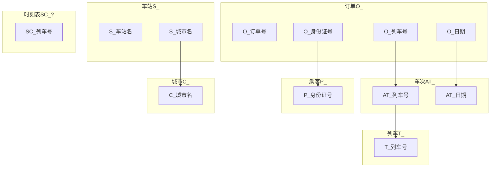

DB-m12306
===============

Database lab2: 火车订票系统模拟.

***

<!-- TOC -->

- [1. 综述](#1-综述)
- [2. 数据库逻辑](#2-数据库逻辑)
    - [2.1. Brief DB-m12306 Schema](#21-brief-db-m12306-schema)
    - [2.2. ER图](#22-er图)
    - [2.3. 关系模式](#23-关系模式)
        - [2.3.1. 列车T_](#231-列车t_)
        - [2.3.2. 列车时刻表TT_XXX](#232-列车时刻表tt_xxx)
        - [2.3.3. 车次AT_](#233-车次at_)
        - [2.3.4. 可用座位表ES_XXX](#234-可用座位表es_xxx)
        - [2.3.5. 城市C_](#235-城市c_)
        - [2.3.6. 车站S_](#236-车站s_)
        - [2.3.7. 乘客P_](#237-乘客p_)
        - [2.3.8. 订单O_](#238-订单o_)
    - [2.4. 范式细化，分析](#24-范式细化分析)
- [3. 查询与刷新函数](#3-查询与刷新函数)
    - [3.1. 写出SQL查询语句的模板（如果有参数，类似TPCH写:1,:2等）](#31-写出sql查询语句的模板如果有参数类似tpch写12等)
- [4. 数据库系统实现](#4-数据库系统实现)
    - [4.1. 数据导入](#41-数据导入)
- [5. 前端实现](#5-前端实现)
    - [5.1. 前端技术栈](#51-前端技术栈)
    - [5.2. 前端与数据库的连接](#52-前端与数据库的连接)
- [6. USAGE(USER STORY)](#6-usageuser-story)
    - [6.1. 记录乘客信息](#61-记录乘客信息)
    - [6.2. 查询具体车次](#62-查询具体车次)
    - [6.3. 查询两地之间的车次](#63-查询两地之间的车次)
    - [6.4. 预订车次座位](#64-预订车次座位)
    - [6.5. 查询订单和删除订单](#65-查询订单和删除订单)
    - [6.6. 管理员](#66-管理员)
- [7. ACKNOWLEDGE](#7-acknowledge)

<!-- /TOC -->

# 1. 综述

***

# 2. 数据库逻辑

***

## 2.1. Brief DB-m12306 Schema

## 2.2. ER图

## 2.3. 关系模式

### 2.3.1. 列车T_

列名|数据种类|附注
-|-|-
车次号|int|identifier
始发站|char(20)|?
中间经停站|?|?
终点站|char(20)|?
每站的发车时间和到达时间|?|?
硬座票价|decimal|?
软座票价|decimal|?
硬卧上铺票价|decimal|?
硬卧中铺票价|decimal|?
硬卧下铺票价|decimal|?
软卧上铺票价|decimal|?
软卧下铺票价|decimal|?
硬座座位数|int|初始化时置为5
软座座位数|int|初始化时置为5
硬卧上铺座位数|int|初始化时置为5
硬卧中铺座位数|int|初始化时置为5
硬卧下铺座位数|int|初始化时置为5
软卧上铺座位数|int|初始化时置为5
软卧下铺座位数|int|初始化时置为5
列车时刻表|?|?

### 2.3.2. 列车时刻表TT_XXX

列名|数据种类|附注
-|-|-
车站id|int|identifier
到达时间|date|
发车时间|date|
硬座票价|decimal|?
软座票价|decimal|?
硬卧上铺票价|decimal|?
硬卧中铺票价|decimal|?
硬卧下铺票价|decimal|?
软卧上铺票价|decimal|?
软卧下铺票价|decimal|?

### 2.3.3. 车次AT_

列名|数据种类|附注
-|-|-
车次号|int|identifier
发车日期|date|identifer
可用座位表|?|?

### 2.3.4. 可用座位表ES_XXX

列名|数据种类|附注
-|-|-
车站id|int|identifier
硬座剩余座位数|int|初始化时置为5
软座剩余座位数|int|初始化时置为5
硬卧上铺剩余座位数|int|初始化时置为5
硬卧中铺剩余座位数|int|初始化时置为5
硬卧下铺剩余座位数|int|初始化时置为5
软卧上铺剩余座位数|int|初始化时置为5
软卧下铺剩余座位数|int|初始化时置为5

注意: 终点站的剩余座位数无用

### 2.3.5. 城市C_

列名|数据种类|附注
-|-|-
城市名|char(20)|identifier

### 2.3.6. 车站S_

列名|数据种类|附注
-|-|-
车站id|int|identifier
车站名|char(20)|
城市名|char(20)|

### 2.3.7. 乘客P_

列名|数据种类|附注
-|-|-
身份证号|int|identifier, unique
手机号|int|unique
姓名|char(20)|
用户名|char(30)|
信用卡|int|

### 2.3.8. 订单O_

列名|数据种类|附注
-|-|-
订单号|int|identifier
身份证号|int|
日期|date|
车次序号|int|

## 2.4. 范式细化，分析

***

# 3. 查询与刷新函数

## 3.1. 写出SQL查询语句的模板（如果有参数，类似TPCH写:1,:2等）

***

# 4. 数据库系统实现

## 4.1. 数据导入

***

# 5. 前端实现

## 5.1. 前端技术栈

## 5.2. 前端与数据库的连接

***

# 6. USAGE(USER STORY)

## 6.1. 记录乘客信息
## 6.2. 查询具体车次
## 6.3. 查询两地之间的车次
## 6.4. 预订车次座位
## 6.5. 查询订单和删除订单
## 6.6. 管理员

***

# 7. ACKNOWLEDGE

[1][网络技术应用: MHW-50382]

***

Copyright (C) 2018 Team WLC(Wireless LAN Controller)