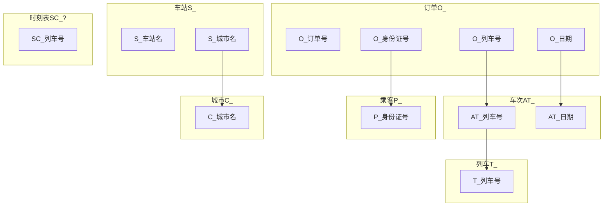

DB-m12306
===============

Database lab2: 火车订票系统模拟.

***

<!-- TOC -->

- [1. 综述](#1-综述)
- [2. 数据库逻辑](#2-数据库逻辑)
    - [2.1. Brief Schema](#21-brief-schema)
    - [2.2. ER图](#22-er图)
    - [2.3. 关系模式](#23-关系模式)
        - [2.3.1. Train 列车T_](#231-train-列车t_)
        - [2.3.2. Train_Table 列车时刻表TT_](#232-train_table-列车时刻表tt_)
        - [2.3.3. Empty_Seat 可用座位表ES_](#233-empty_seat-可用座位表es_)
        - [2.3.4. Station 车站S_](#234-station-车站s_)
        - [2.3.5. Passenger 乘客P_](#235-passenger-乘客p_)
        - [2.3.6. Order 订单O_](#236-order-订单o_)
        - [2.3.7. Station_Connection 车站联通表SC_](#237-station_connection-车站联通表sc_)
        - [2.3.8. City_Connection 城市联通表CC_](#238-city_connection-城市联通表cc_)
        - [ID_Station_City 车站城市对照表ISC_](#id_station_city-车站城市对照表isc_)
    - [2.4. 范式细化，分析](#24-范式细化分析)
- [3. 查询与刷新函数](#3-查询与刷新函数)
    - [3.1. 写出SQL查询语句的模板（如果有参数，类似TPCH写:1,:2等）](#31-写出sql查询语句的模板如果有参数类似tpch写12等)
- [4. 数据库系统实现](#4-数据库系统实现)
    - [4.1. 数据导入](#41-数据导入)
- [5. 前端实现](#5-前端实现)
    - [5.1. 前端技术栈](#51-前端技术栈)
    - [5.2. 前端与数据库的连接](#52-前端与数据库的连接)
- [6. USAGE(USER STORY)](#6-usageuser-story)
    - [6.1. 记录乘客信息](#61-记录乘客信息)
    - [6.2. 查询具体车次](#62-查询具体车次)
    - [6.3. 查询两地之间的车次](#63-查询两地之间的车次)
    - [6.4. 预订车次座位](#64-预订车次座位)
    - [6.5. 查询订单和删除订单](#65-查询订单和删除订单)
    - [6.6. 管理员](#66-管理员)
- [7. ACKNOWLEDGE](#7-acknowledge)

<!-- /TOC -->

# 1. 综述

***

# 2. 数据库逻辑

***

## 2.1. Brief Schema

## 2.2. ER图

## 2.3. 关系模式

Table Layouts 如下:

### 2.3.1. Train 列车T_

列名|内容|数据种类|附注
-|-|-|-
T_tid|车次号|char(10)|identifier
T_start_station|始发站|char(20)|
T_end_station|终点站|char(20)|

### 2.3.2. Train_Table 列车时刻表TT_

列名|内容|数据种类|附注
-|-|-|-
TT_tid|车次号|char(10)|identifier
TT_depart_station|出发车站id|int|identifier
TT_arrive_station|到达车站id|int|identifier
TT_depart_time|发车时间|date|
TT_arrive_time|到达时间|date|
TT_price_yz|硬座票价|decimal|
TT_price_rz|软座票价|decimal|
TT_price_yws|硬卧上铺票价|decimal|
TT_price_ywz|硬卧中铺票价|decimal|
TT_price_ywx|硬卧下铺票价|decimal|
TT_price_rws|软卧上铺票价|decimal|
TT_price_rwx|软卧下铺票价|decimal|

### 2.3.3. Empty_Seat 可用座位表ES_

列名|内容|数据种类|附注
-|-|-|-
ES_tid|车次号|char(10)|identifier
ES_current_sid|当前车站id|int|identifier
ES_next_sid|下一个车站id|int|identifier
ES_date|日期|date|identifier
ES_left_yz|硬座剩余座位数|int|初始化时置为5
ES_left_rz|软座剩余座位数|int|初始化时置为5
ES_left_yws|硬卧上铺剩余座位数|int|初始化时置为5
ES_left_ywz|硬卧中铺剩余座位数|int|初始化时置为5
ES_left_ywx|硬卧下铺剩余座位数|int|初始化时置为5
ES_left_rws|软卧上铺剩余座位数|int|初始化时置为5
ES_left_rwx|软卧下铺剩余座位数|int|初始化时置为5

注意: 终点站的剩余座位数无用

<!-- ### 2.3.5. 城市C_

列名|数据种类|附注
-|-|-
城市名|char(20)|identifier -->

### 2.3.4. Station 车站S_

列名|内容|数据种类|附注
-|-|-|-
S_sid|车站id|int|identifier, unique
S_sname|车站名|char(20)|
S_cname|城市名|char(20)|

### 2.3.5. Passenger 乘客P_

列名|内容|数据种类|附注
-|-|-|-
P_pid|身份证号|int|identifier, unique
P_phone|手机号|int|unique
P_pname|姓名|char(20)|
P_uname|用户名|char(30)|
P_credit_card|信用卡|int|

### 2.3.6. Order 订单O_

列名|内容|数据种类|附注
-|-|-|-
O_oid|订单号|int|identifier
O_pid|身份证号|int|
O_date|日期|date|
O_tid|车次序号|char(10)|
O_start_sid|始发站|int|
O_arrive_sid|到达站|int|

### 2.3.7. Station_Connection 车站联通表SC_

列名|内容|数据种类|附注
-|-|-|-
SC_depart_sid|出发车站|int|identifier
SC_arrive_sid|到达车站|int|identifier
SC_tid|列车号|int|identifier

### 2.3.8. City_Connection 城市联通表CC_

列名|内容|数据种类|附注
-|-|-|-
CC_depart_city|出发城市|int|identifier
CC_arrive_city|到达城市|int|identifier
CC_tid|列车号|int|identifier

***

原始数据的Table, Layouts如下:

### ID_Station_City 车站城市对照表ISC_

## 2.4. 范式细化，分析

***

# 3. 查询与刷新函数

## 3.1. 写出SQL查询语句的模板（如果有参数，类似TPCH写:1,:2等）

***

# 4. 数据库系统实现

## 4.1. 数据导入

***

# 5. 前端实现

## 5.1. 前端技术栈

## 5.2. 前端与数据库的连接

***

# 6. USAGE(USER STORY)

## 6.1. 记录乘客信息
## 6.2. 查询具体车次
## 6.3. 查询两地之间的车次
## 6.4. 预订车次座位
## 6.5. 查询订单和删除订单
## 6.6. 管理员

***

# 7. ACKNOWLEDGE

[1][网络技术应用: MHW-50382]

***

Copyright (C) 2018 Team WLC(Wireless LAN Controller)