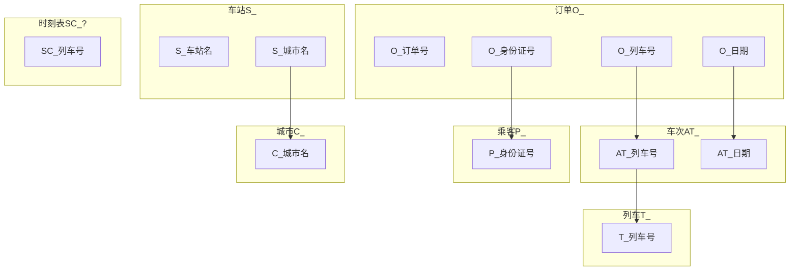

```mermaid
graph TD;

subgraph 列车T_
T_列车号
end

subgraph 车次AT_
AT_列车号
AT_日期
end

subgraph 城市C_
C_城市名
end

subgraph 车站S_
S_车站名
S_城市名
end

subgraph 乘客P_
P_身份证号
end

subgraph 订单O_
O_订单号
O_身份证号
O_列车号
O_日期
end

subgraph 时刻表SC_?
SC_列车号
end

O_身份证号-->P_身份证号
S_城市名-->C_城市名
O_列车号-->AT_列车号
AT_列车号-->T_列车号
O_日期-->AT_日期

```